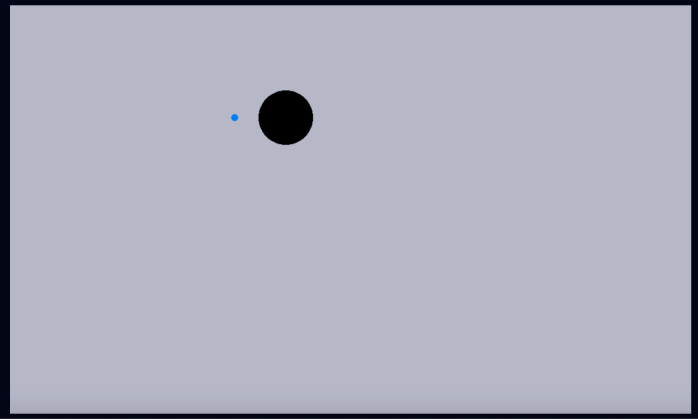
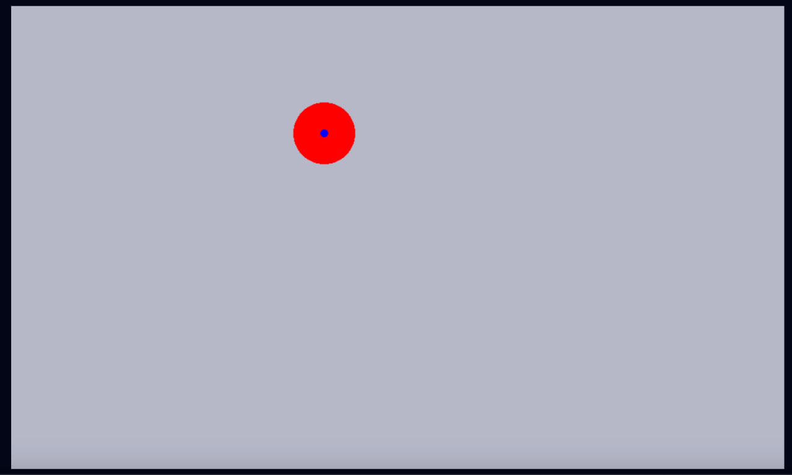
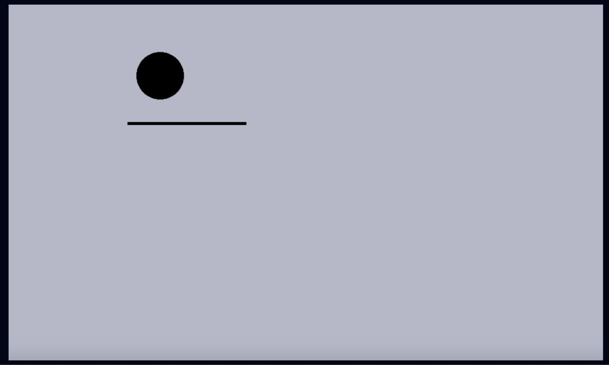
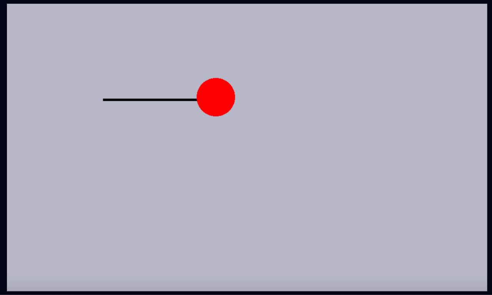
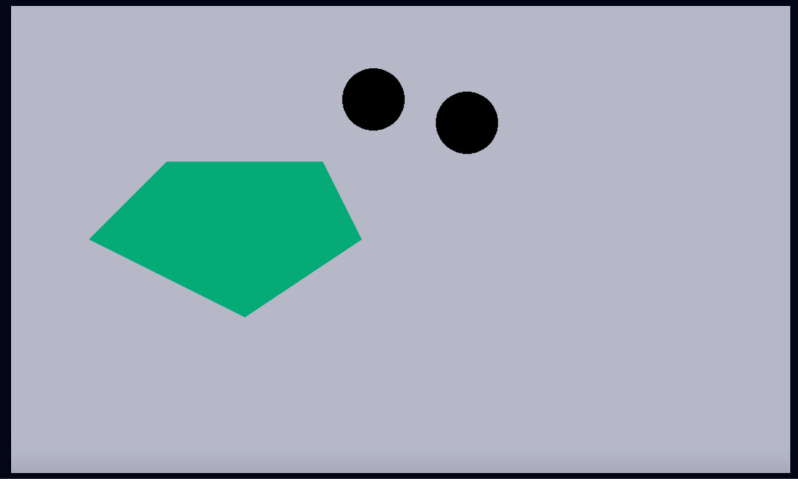
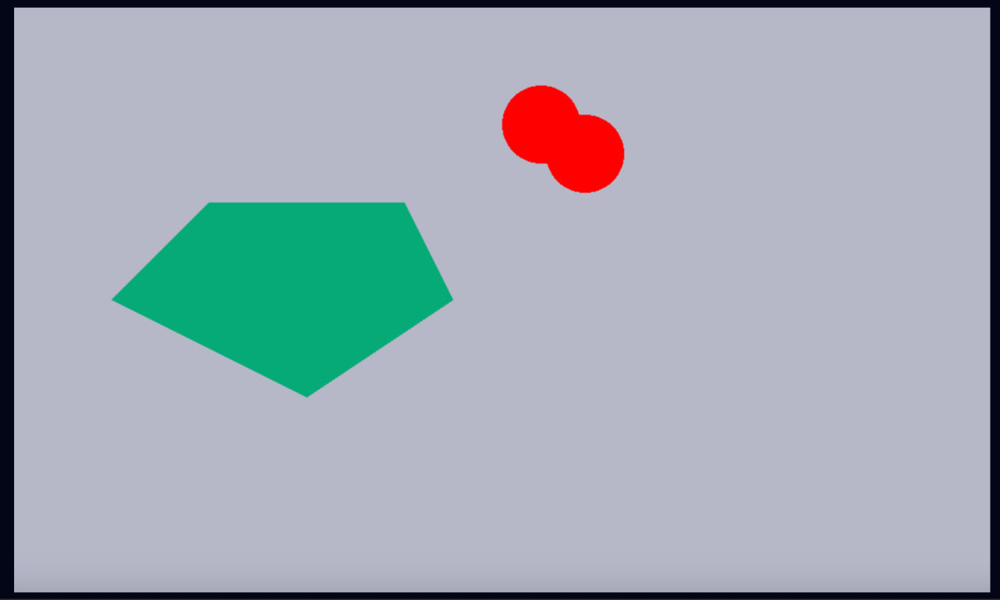
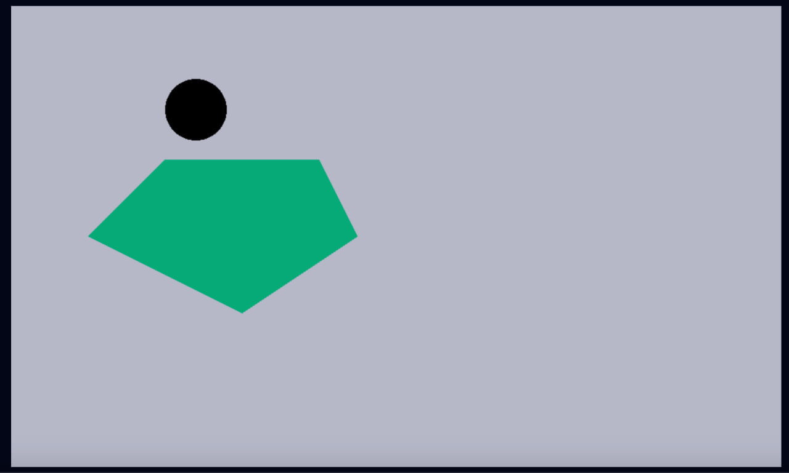
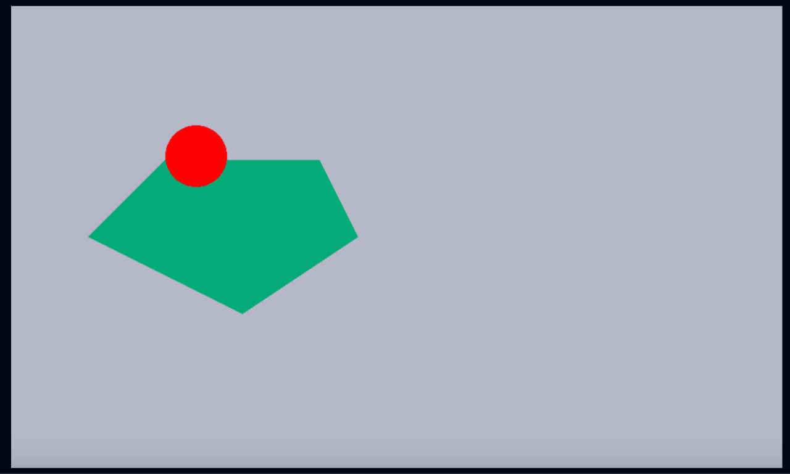
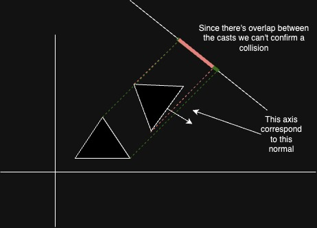
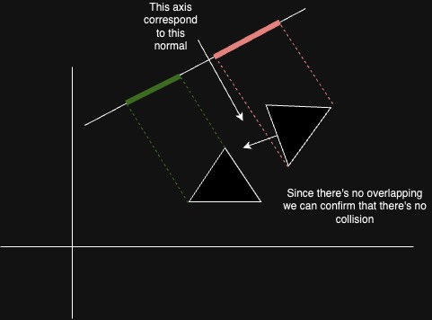

# Collision detection

## Jeffrey Thompson's implementation
A collision detection library implementation based on [https://www.jeffreythompson.org/collision-detection/](https://www.jeffreythompson.org/collision-detection/).

We are working with entities.

These entities can be of any of these types: Point, Line, Circle, Polygon.

Each entity has attributes, which can be mandatory or not:
- `id (unsigned int)`: unique identifier
- `shape (Shape)`: Point, Line, Circle, Polygon. To determine which collision algorithm to use
- `radius (float)`: in the case of a circle
- `speed (float)`: in case of movement
- `direction (Direction {x: float, y: float})`: in case of movement
- `category (Category)`: Player, Projectile, Obstacle. We use it to know when to check for collisions
- `vertices (array of Position {x: float, y: float})`: in case the entity is defined by points
- `position (Position {x: float, y: float})`: position of the entity on the map

For collision checking, we iterate through entities searching for those that collide with the current one and return a list of all collisions.

The possible collision detection algorithms we handle are:

- Point-Circle: Collision occurs when the distance between the center of the circle and the point is less than the radius of the circle





- Line-Circle: Collision occurs when the closest point on the line is inside the circle. It should be noted that when finding the nearest point, it should be within the segment.





- Circle-Circle: Collision occurs when the distance between the centers of the circles is less than the sum of the radius





- Circle-Polygon: Collision occurs when there is a collision between the circle and any of the segments of the polygon, or when the center of the circle is inside the polygon





There is a special case when a circle is inside a polygon, and there are two alternatives.

If you want to detect that collision, you should add this function call at the end of the `circle_polygon_collision`:
```
point_polygon_colision(circle, polygon)
```
If you only need to detect when a circle collides with the "walls" of the polygon, you should `return false`, and that's it.

It is necessary to clarify that there are other types of collisions that we do not need to implement at the moment, for example Polygon/Polygon.

## SAT (Simple Axis Theorem) implementation
A collision detection library implementation based on the [SAT theorem](https://dyn4j.org/2010/01/sat/).

We'll keep working with entities with the same shapes as the ones used by Jeffrey Thompson.

To detect a collision between two entities, we'll iterate over an axis for each pair of vertices from both entities that collided.
For circular shapes, we'll check the axis that's formed between the circle center and the closest polygon vertex, and then cast the
maximum and minimum vertex to the normal of each pair of vertices. As soon as we find an axis where the cast of the shapes are not overlapping, we can safely say that the entities are not colliding.

#### Triangle example for axis where the cast in the axis are overlapping

#### Triangle example for axis where the cast in the axis are not overlapping


The collisions we currently support are:

1. Circle with polygon:


## Collision resolution

The Jeffrey Thompson's implementation for collision detection is ideal since it's the cheapest way to 
detect that two entities collided, but it's incomplete since we can only detect that a collision occurred 
and nothing else, so we decided to take the following approach:

1. We use the Jeffrey Thompson's implementation to detect that a collision actually happened.
2. Using SAT we can get the normal that will resolve that collision and the amount of movement we should do 
so the entities are no longer colliding, so when a collision occurs we will use SAT to push the entities in the direction that, with the minimum movement, will resolve that collision.
