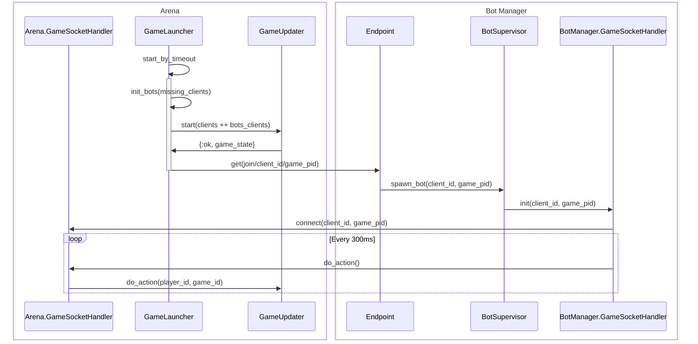

# BotManager

Application to host bots for matches taking place in `arena` application

## Usage 

To generate a bot just do a `get` to the following url: `http://localhost:5000/join/:game_id/:client_id`  where:
- game_id: is the result of doing the following operation to the [`pid`](https://hexdocs.pm/elixir/processes.html)  running the game_updater instance: `self() |> :erlang.term_to_binary() |> Base58.encode()`
- client_id: is the is of the player entity assigned while the game is being created

## Communication between arena and bot manager

## Behavior
<!-- TODO implement complex behavior -->
- the bot will send a move message every 300 ms

## Decisions

The connection between arena and  bot manager will be different as normal client since we're not creating a socket handler first.
The way it work is:
1. We receive a `game_id` to connect and a `client_id` to control in that game through a GET request to the 
bot manager endpoint
2. we spawn a websocket with the `BotManager.GameSocketHandler` module with this params
3. The websocket connects with `Arena.GameSocketHandler` and retreive the player_id 
4. We communicate using the `BotManager.GameSocketHandler` to tell the `Arena.GameSocketHandler` to send
an action to the `game_updater` process in charge of the `game_id` we got on the get request

This allow us some benefits:
1. The `game_launcher` from arena doesn't care if we spawned a bot, or even if the bot manager is alive at 
all to start a game
2. The game will always start a game without delays due to bot spawning, when the bots are ready they'll 
start sending message as nothing happended
3. If a player disconnects from a game we could spawn a bot by just doing a get request to the manager
with the `client_id` that disconnected and the `game_id`
