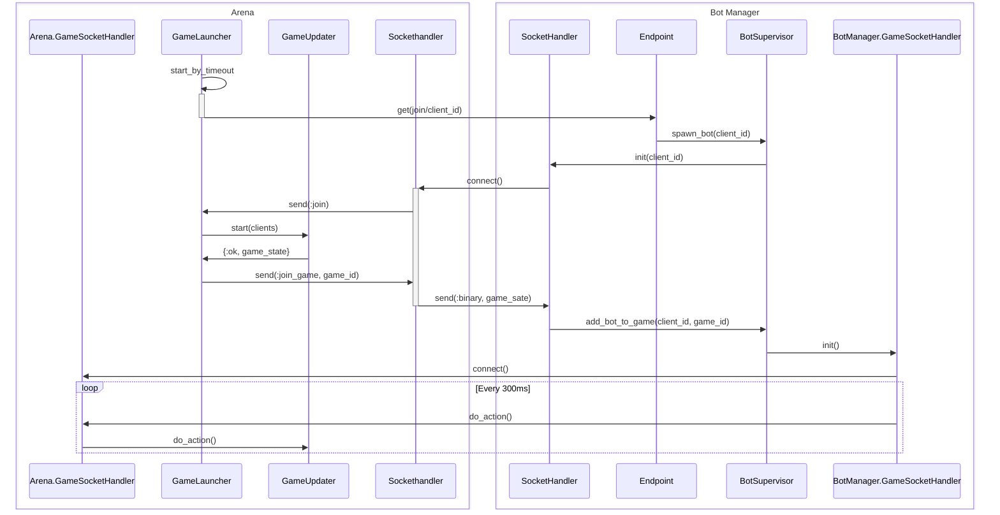

# BotManager

Application to host bots for matches taking place in `arena` application

## Usage 

To generate a bot just do a `get` to the following url: `http://localhost:5000/join/:game_id/:player_id`  where:
- game_id: is the result of doing the following operation to the [`pid`](https://hexdocs.pm/elixir/processes.html)  running the game_updater instance: `self() |> :erlang.term_to_binary() |> Base58.encode()`
- player_id: is the is of the player entity assigned while the game is being created

## Communication between arena and bot manager

## Behavior
<!-- TODO implement complex behavior -->
- the bot will send a move message every 300 ms

