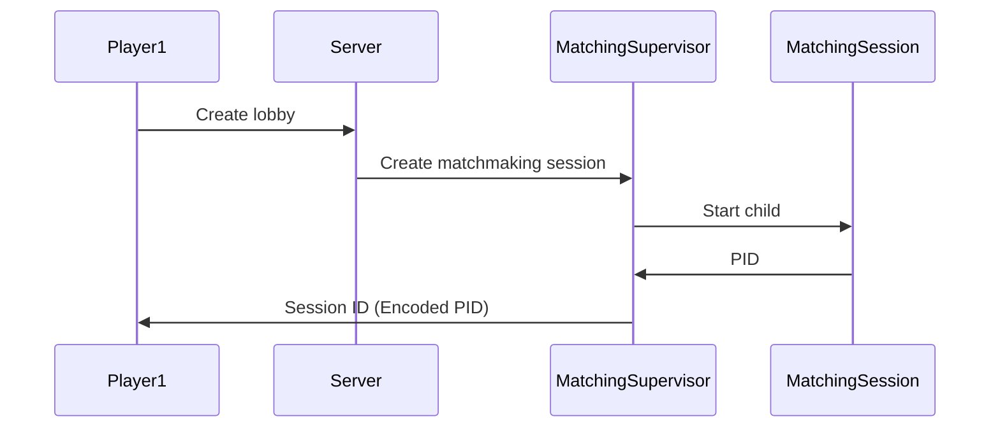
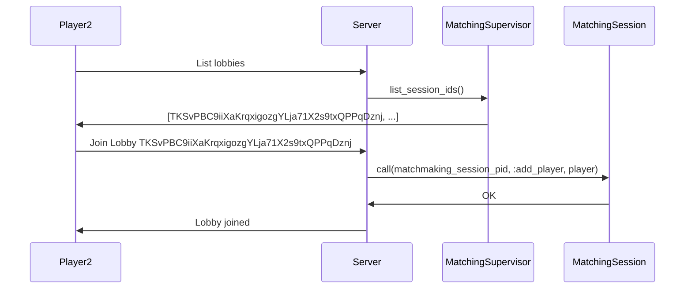
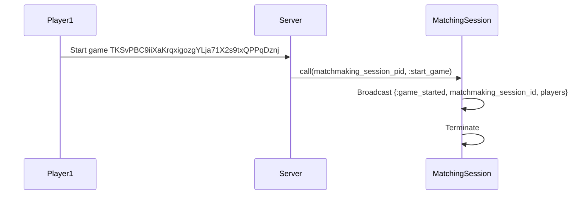
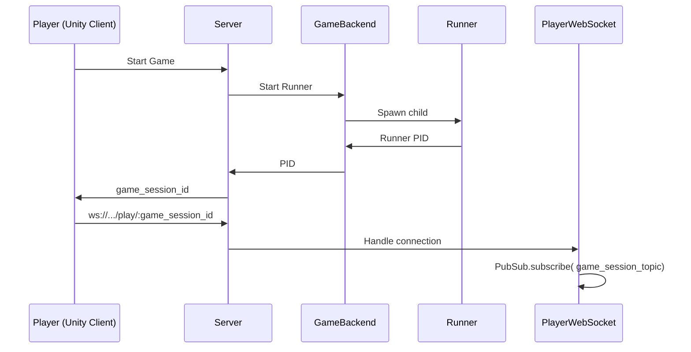
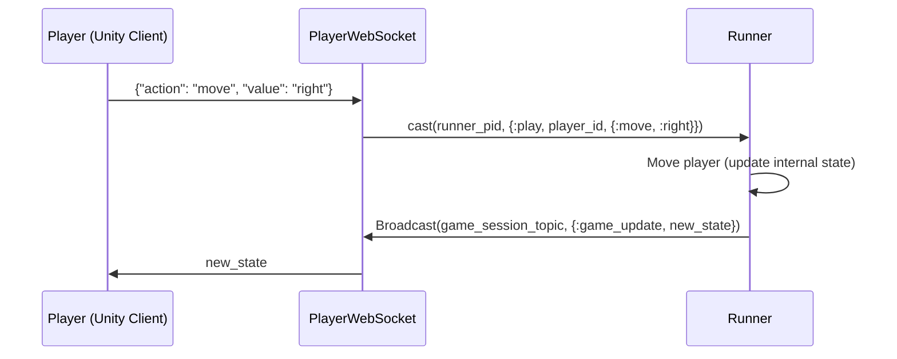

# Backend Architecture

In this document we go over how the backend is structured. Currently, it serves two related but distinct purposes:

- It provides a matchmaking functionality, where players join lobbies with other players hoping to start a game or create their own so others can join.
- Once a game starts, it acts as the authoritative server for it. It receives players' actions, updates the game state according to the rules of the game, then sends it back to players. We'll call this the *gameplay* functionality.

Having a p2p solution is not possible due to potential cheats and due to connectivity problems between cellphones.
The server is responsible of coordinating state between clients and banning cheaters.

The architecture of the server should be as simple as possible. 

- 1 process per player
- 1 game_state process
- N+1 processes in total with N being the number of players

## Round
1. Clients send messages to the `game_state` process
2. Game state processes all messages in order
3. The `tick`, which is the clock of the game, is updated and the game state process sends a small delta update to all the players with the changes that were realized during the tick.

> Most of the work is done during 3 where collision is detected, powers get consumed, crates get spawned or assigned to a client, damage and death are resolved.
4. Go to 1.

## API
We aim for the API provided to clients during a game to be as simple as possible:

- move(joystick_values): Allows a player to move through the board by providing joystick values corresponding to the direction of movement.
- use_skill(skill_name, joystick_values): Accepts joystick values for skill direction along with the skill name.
- refresh: Used to request the entire game state.

Additionally, the server can communicate various messages to the clients:

- game_started: Indicates the start of the game.
- game_finished: Signals the end of the game.
- state_update: Contains all the information about the game
- player_joined: Indicates a player joining the game.
- ping_update: Used to inquire about the server's ping.

## Matchmaking

For matchmaking to work, players should be able to join a game, which will automatically start once the lobby is full or we reach a time limit (whichever happens first). 

There is a single process taking care of the matchmaking, the `MatchingCoordinator`. This process is responsible for keeping track of a queue that receives all players that press the play button, launching a new game when it reaches the max capacity for a game or the time limit is reached (launching the game with bots).

When the game starts, each player connects to the server through a websocket. The server spawns a new process for each connection, which we'll call `PlayWebSocket`. This process is responsible for handling the connection and relaying messages between the player and the game. We'll go into more detail about this later.


### Create lobby



### Join game



### Start game



## Gameplay

When a game starts, two things happen:

- A game session is spawned by a `DynamicSupervisor` called `GameBackend`.  This `GameBackend` starts a new child `Runner` process, which holds the entire game's state and the logic to update it according to the players' actions. The PID of this `Runner` is encoded in a human friendly format and called the `game_session_id`.
- Every player connects to the game through websocket under the `/play/:game_id/:client_id/:player_id` path. Each player's connection is handled by a separate [cowboy websocket](https://ninenines.eu/docs/en/cowboy/2.6/manual/cowboy_websocket/) process, defined in the `PlayWebSocket` module. On startup, the process saves the runner's PID so it can communicate with it. Inside the game, a player is the same as a websocket connection.

Let's go over the main gameplay flow. Let's say `player_1` wants to move to the right one square. To do this, they send a `JSON` frame over the socket that looks like this:

```json
{"action": "move_with_joystick", "value": "{angle}"}
```

The corresponding `PlayWebSocket` process picks it up, decodes it, then sends a message to the `Runner` with the player's action like this:

```elixir
GenServer.cast(runner_pid, {:move, user_id, action})
```

The `Runner`'s appropriate handler eventually picks up this message, which in this case looks like this:

```elixir
  def handle_cast({:move, user_id, %Move{angle: angle}, timestamp}, state) do
    player_id = state.user_to_player[user_id] || user_id
    game_state = GameBackend.move_player(state.game_state, player_id, angle)

    state =
      Map.put(state, :game_state, game_state)
      |> put_in([:player_timestamps, user_id], timestamp)

    {:noreply, state}
  end
```

Every action handler updates the game state accordingly. We're managing game
updates through a tick rate. The runner sends a message to itself every 30ms and
does a broadcast of the new state. Currently, this is being done on the handler
that matches with `:game_tick`.

You'll notice the `websocket_init` function on the `PlayWebSocket` process does (among other things) the following:

```elixir
:ok = Phoenix.PubSub.subscribe(DarkWorldsServer.PubSub, "game_play_#{game_id}")
```

This allows the socket processes to receive state updates they can then relay to the player.

Below are two diagrams summarizing the whole flow.

### New Game



### Gameplay



# Comments/Omissions

## State management and Rust NIFs

In the architecture walkthrough above, we glossed over how the game state is handled. This state is kept inside the `Runner` process, but *state transitions* (players moving, attacking, etc) are computed in Rust. To call Rust code from Elixir we use [Rustler](https://github.com/rusterlium/rustler), which allows us to write `NIF`s; a way to call low level performant code inside the Erlang VM. You can read more about them [here](https://www.erlang.org/doc/tutorial/nif.html) and [here](https://www.erlang.org/doc/man/erl_nif.html).

All the Rust game state code is located inside the `native/gamestate` directory. The functions exposed to Elixir are all in the `lib.rs` file. Here's the function that we call to move players around the map:

```rust
#[rustler::nif()]
fn move_player(game: GameState, player_id: u64, direction: Direction) -> GameState {
    let mut game_2 = game;
    game_2.move_player(player_id, direction);
    game_2
}
```

The associated Elixir function is inside the `GameBackend.Game` module:

```elixir
def move_player(_a, _b, _c), do: :erlang.nif_error(:nif_not_loaded)
```

The magic that makes this call Rust underneath is all inside this `use` declaration

```elixir
use Rustler, otp_app: :dark_worlds_server, crate: "gamestate"
```

Every Rust Struct has a corresponding Elixir struct that it maps to; calling the Elixir functions is transparent to someone using the API.
