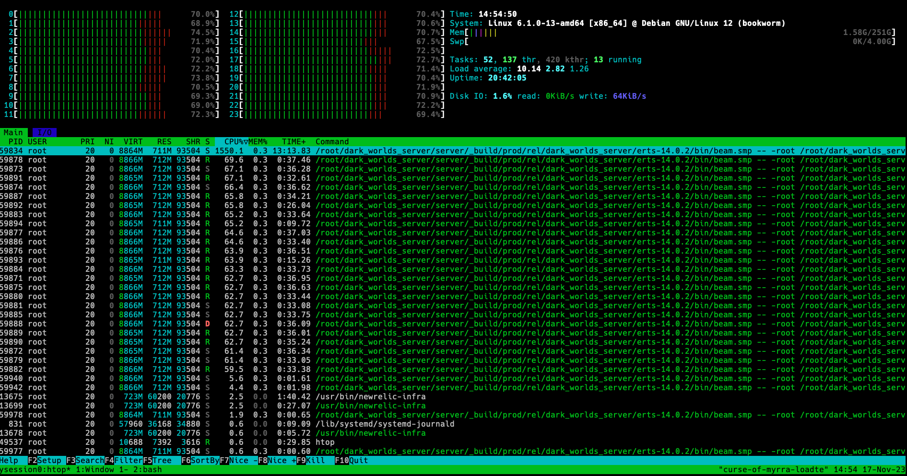
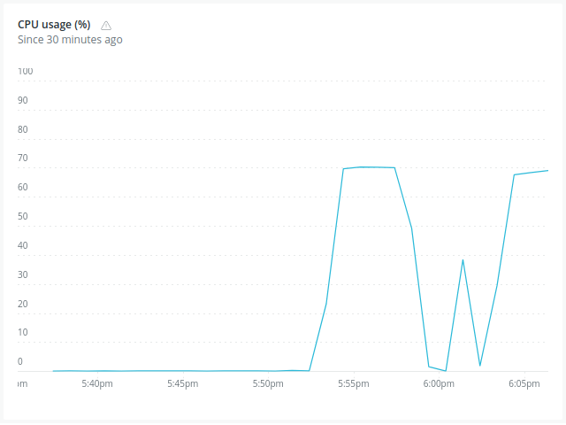
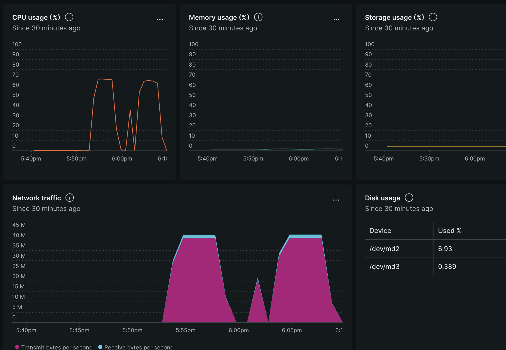
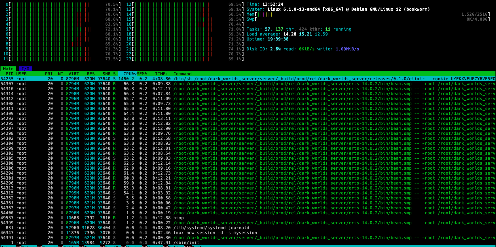
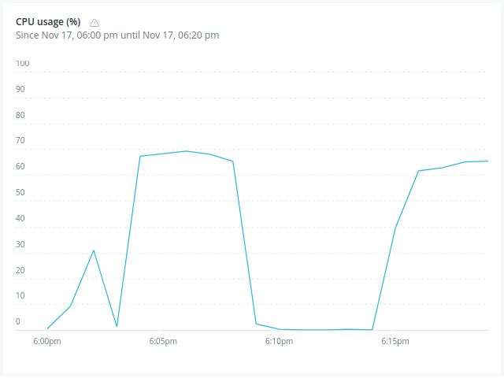
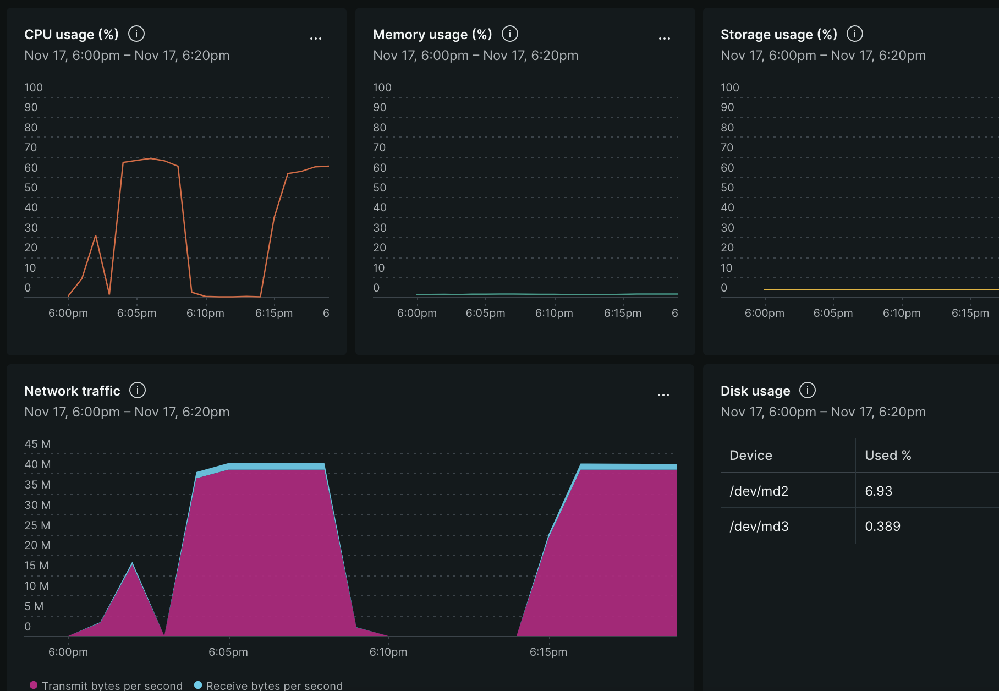

Tests were ran using an [AMD ryzen 3600](https://www.amd.com/en/support/cpu/amd-ryzen-processors/amd-ryzen-5-desktop-processors/amd-ryzen-5-3600) with 6 physical cores for the server running the load test and an [Intel XEON Gold 5412U](https://www.intel.la/content/www/xl/es/products/sku/232374/intel-xeon-gold-5412u-processor-45m-cache-2-10-ghz/specifications.html) with 24 physical cores.

We'll run using
`LoadTest.PlayerSupervisor.spawn_players(NUMBER_OF_USERS, PLAY_TIME)` where
PLAY_TIME is the amount in seconds the players play before closing the
connection.

Each 10 players, a game is created, so the 600 players are distributed among 60 games.

- Game server is running without dirty scheduler on branch `gh-1125-load-tests-with-optimizations`
- Changed tick rate to 20ms to have the same that is currently on main
- Changed cpu governor to `on demand` with the command: `# cpupower frequency-set -g *governor*`

# 60 games of 10 players each, 5 minutes.

Htop during Load Test

Second run of the same load.

Second run of the same load, As expected, CPU spikes when connections are made.

# 50 games, 10 players each, 5 mins.

Second load with 500 players, starts at 6:15pm.

# 
