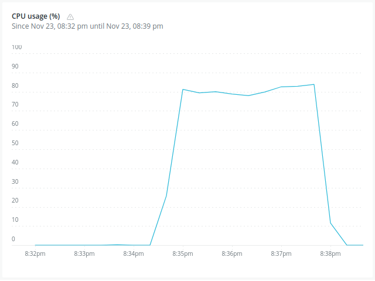

# Load Test Report: 23 and 24 Nov 
## Specs:
### Game Server:
- OS: Debian 6.1
- CPU: Intel(R) Xeon(R) Gold 5412U  - 24 real cores.
- Hyper-thread disabled.
- 256GB RAM.
- 4GB Swap.
### Load Testing Client:
- OS: Debian 6.1
- CPU: AMD Ryzen 3600 (6 cores reales).
- Hyper-thread disabled.
- 64 GB RAM.
- 32 GB Swap.

### Non-Dirty Scheduling Results:
#### 50 games - 10 players per game.





#### 1000 players
.png>) 

#### Notes:
- Each player sent an action each 30 ms.
- Really really poor UX, game freezes and projectiles
  behave badly.
- For the 100 games with 10 players each tests (i.e. 1000 players in total),
  we had to increase the file descriptor limit with ulimit -n 65000 on both 
  the server and the client.
- We used the LoadTest.PlayerSupervisor.spawn_players/2 function
  for each load test.

### NIF Measurement
We logged the running times of NIFs into a file as (pseudocode):
```
now = System.monotonic_now()
nif_result = nif_call()
later = System.monotnic_now()
log(later-now)
```
The results for the add players and world ticks NIFs were:
```
Adding player -> Average: 3362771.47 nanoseconds, Max: 10716040, Min: 69592, Std Dev: 2761430.42.

World tick -> Average: 11528319.50 nanoseconds, Max: 61829335, Min: 7125910, Std Dev: 8293649.83
```
This was done through the python script 'stat.py', located
on this folder.
A random sample from the logs(in nanoseconds):
```
8:30:20.787 [info] World tick took: 113150295
18:30:20.787 [info] World tick took: 102089900
18:30:21.192 [info] World tick took: 20942281
18:30:21.255 [info] World tick took: 20161654
18:30:21.655 [info] World tick took: 92326460
18:30:21.814 [info] World tick took: 28705191
18:30:22.454 [info] World tick took: 23800549
18:30:22.482 [info] World tick took: 24902195
18:30:22.996 [info] World tick took: 23280266
18:30:23.851 [info] World tick took: 24042991
18:30:24.183 [info] World tick took: 27528790
18:30:25.051 [info] World tick took: 99569373
18:30:25.437 [info] World tick took: 23379148
18:30:26.092 [info] World tick took: 28426557
18:30:26.123 [info] World tick took: 27050989
```
### Flamegraph
We though a good starting point for the flamegraph 
was the WebSocket module, here's the result:
.png>)


### UX Focused Load Testing:

We found out that with:
- An action each 30ms from the load testing clients.
- 20 games with 10 players each (i.e. 200 players).
The game would become unplayable and unstable.
### 100 players with Dirty and Non Dirty, respectively:
 
### 200 players with Dirty and Non Dirty, respectively:
 .

### Possible improvements:
- Since 30ms for an action is not realistic,
  we changed it to 200ms and found that the game improved,
  even with 60 games of players 10 each around (600 players). We still need to test when
  exactly the gameplay degrades.
- New algorithm for the World Tick.
