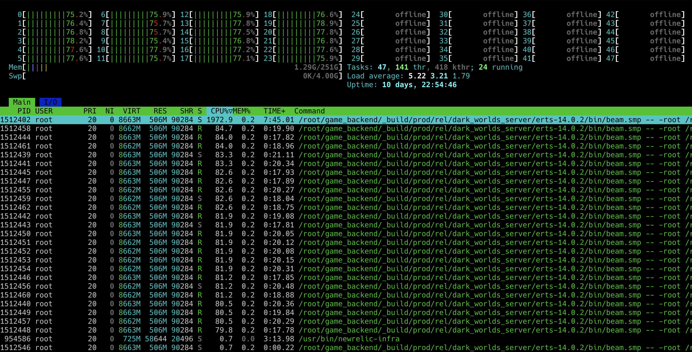
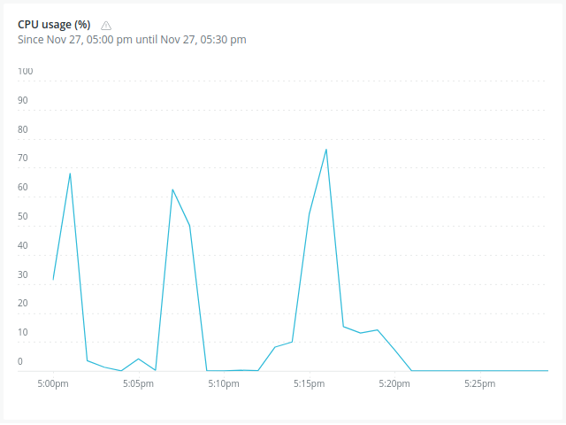
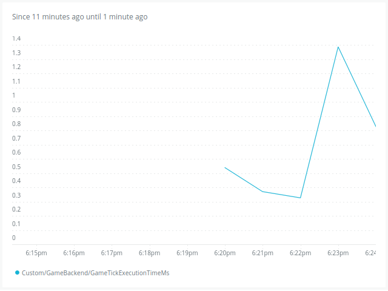
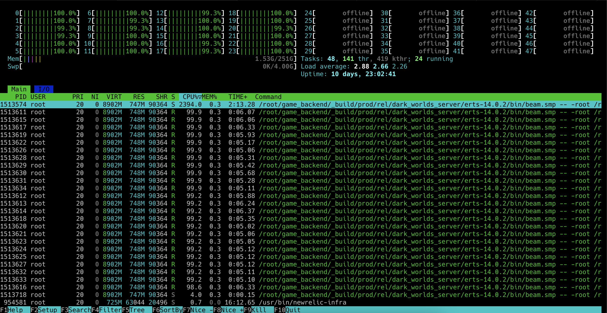
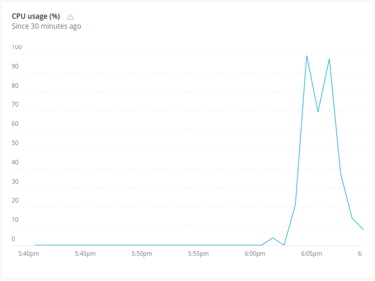
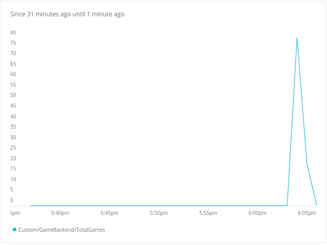
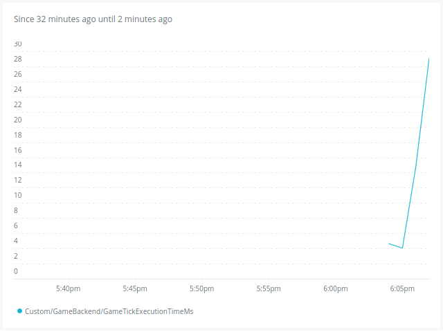

# Load Test Report: 27 Nov 
## Specs:
### Game Server:
- OS: Debian 6.1
- CPU: Intel(R) Xeon(R) Gold 5412U  - 24 real cores.
- Hyper-thread disabled.
- 256GB RAM.
- 4GB Swap.
### Load Testing Client:
- OS: Debian 6.1
- CPU: AMD Ryzen 3600 (6 cores reales).
- Hyper-thread disabled.
- 64 GB RAM.
- 32 GB Swap.

Today a PR got merged removing the dirty schedulers for NIF execution.

### Non-Dirty Scheduling Results:
#### 50 games of 10 players each

#### 100 games of 10 players each

#### Notes:

- we can now see custom metrics on new_relic. 
    - The game tick with 1000 players is taking too much time (39s peak)
    - The game tick with 500 players is not taking as much (1.5s peak)

### UX Focused Load Testing: While running the load tests, a separate game was
launched from Unity to see if there are any noticeable UX issues when the load
is high.

#### 50 games of 10 players each

Almost everything worked smoothly, but almost at the end of the game the game
froze. It's possible that it was because of an issue other than performance
because I re-retried the test and it did not happen.

#### 100 games of 10 players each

For this amount of players the game became unplayable. There was a big delay
and also some warping coming from the players and the projectiles. Also a few
seconds in the game, it froze and never came back up.

### Possible improvements:

- Today's load test point that there's an issue with the game tick, which
exacerbates under high loads.
