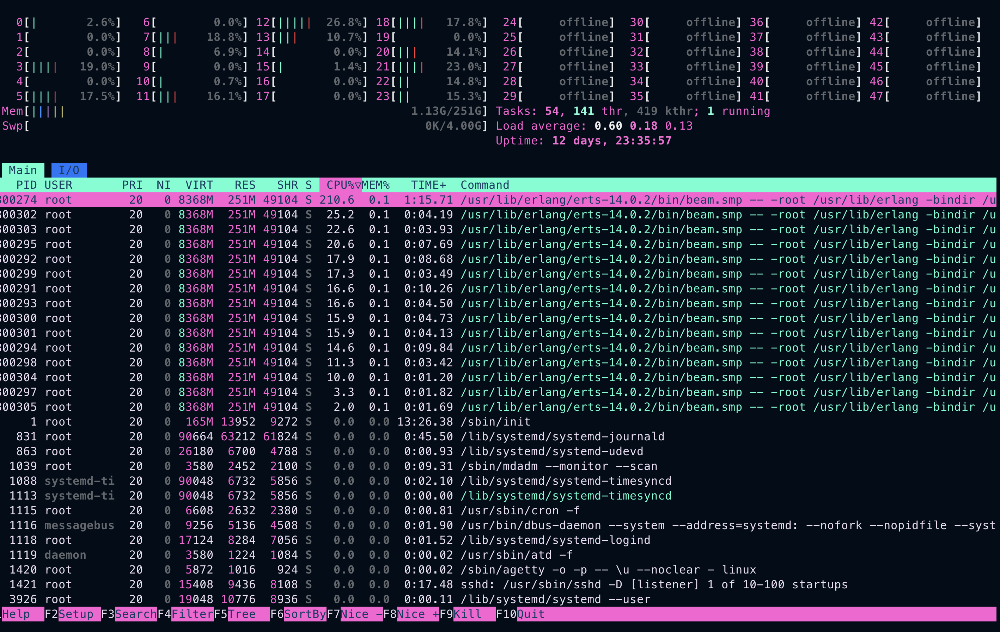
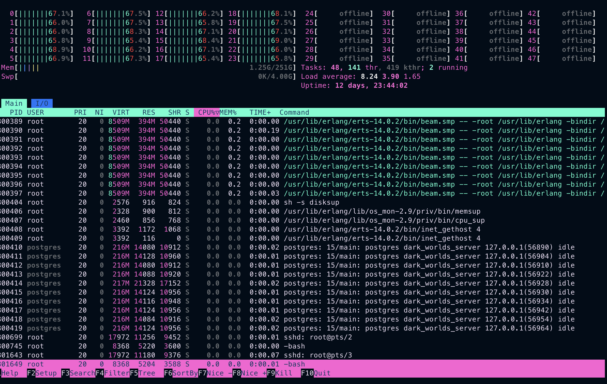
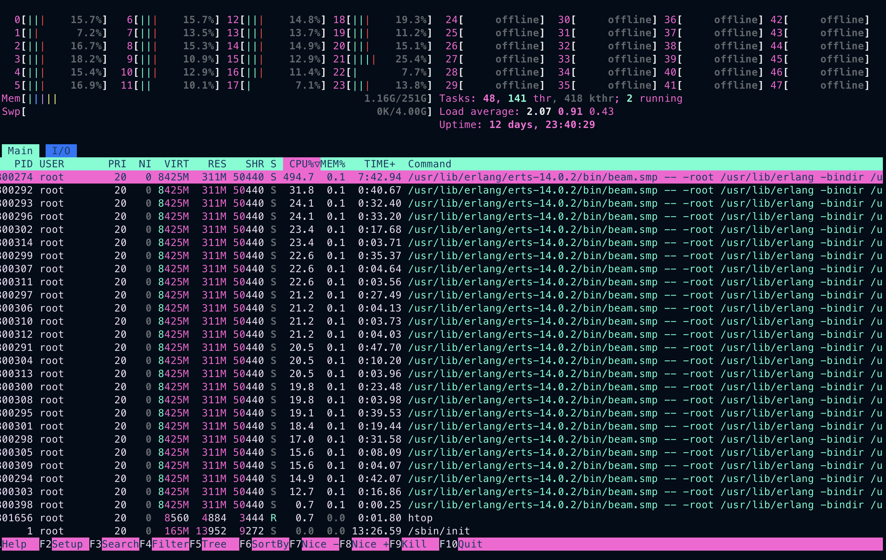

Tests were ran using an [AMD ryzen 3600](https://www.amd.com/en/support/cpu/amd-ryzen-processors/amd-ryzen-5-desktop-processors/amd-ryzen-5-3600) with 6 physical cores for the server running the load test and an [Intel XEON Gold 5412U](https://www.intel.la/content/www/xl/es/products/sku/232374/intel-xeon-gold-5412u-processor-45m-cache-2-10-ghz/specifications.html) with 24 physical cores.

We'll run using
`LoadTest.PlayerSupervisor.spawn_players(NUMBER_OF_USERS, PLAY_TIME)` where
PLAY_TIME is the amount in seconds the players play before closing the
connection.

Each 10 players, a game is created, so the 600 players are distributed among 60 games.

- Game server is running without dirty scheduler on branch `main #02abd12`

# 5 games of 10 players each, 10 minutes.

# 10 games, 10 players each, 10 mins.

# 40 games, 10 players each, 10 mins.

# 100 games, 10 players each, 10 mins.

# Notes

- All the games was all muflus, no H4cks. Thats why the server was running well.
- 5, 10 and 40 was really playable with a median of 250 ms.
- I could not join the 100 games test, the server had a timeout.
