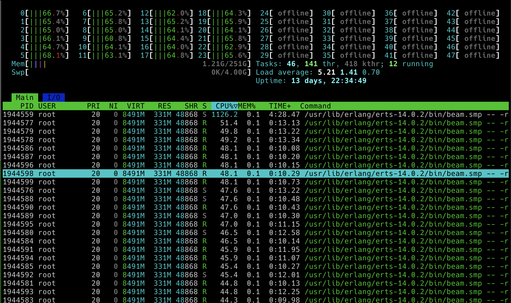
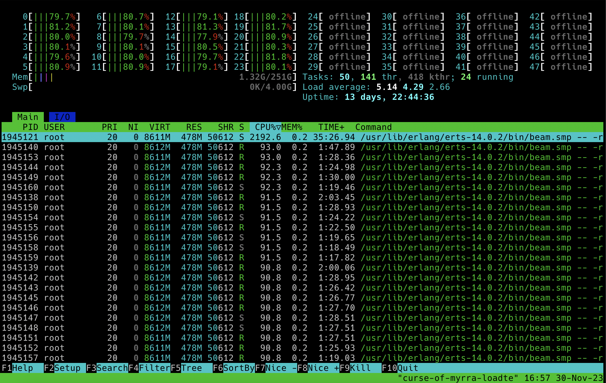
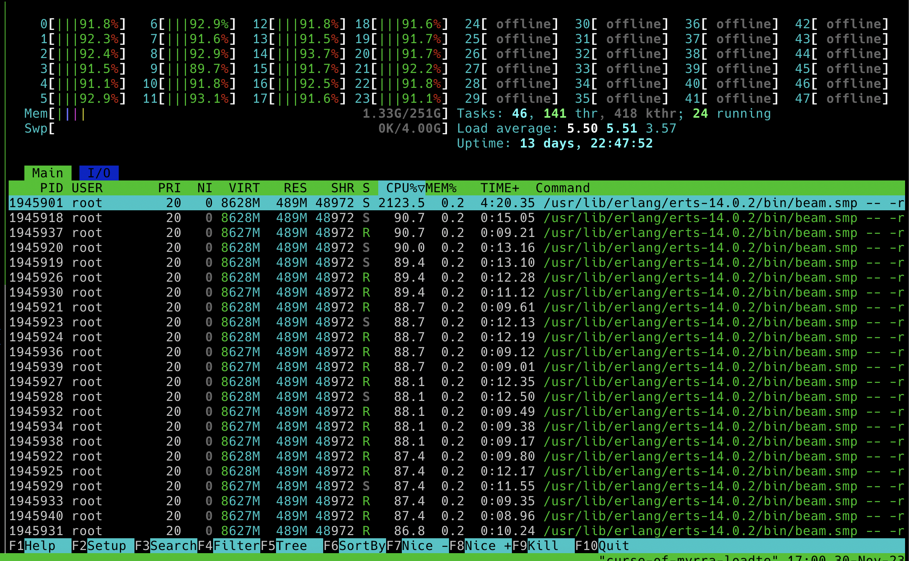

# Load Test Report: 30 Nov 
## Specs:
### Game Server:
- OS: Debian 6.1
- CPU: Intel(R) Xeon(R) Gold 5412U  - 24 real cores.
- Hyper-thread disabled.
- 256GB RAM.
- 4GB Swap.
### Load Testing Client:
- OS: Debian 6.1
- CPU: AMD Ryzen 3600 (6 cores reales).
- Hyper-thread disabled.
- 64 GB RAM.
- 32 GB Swap.

Context:

Today we ran the load test from branch
`gh-1215-change-integers-to-floats-for-position-representations` (commit
`3768480`). This introduces a series of changes in field types that are part of
the internal state of the backend and some that are sent through websockets via
protobuf.

Also, something to be aware of is that recently `h4ck` was removed (this change
is temporary though) and thus the load test won't have projectiles in the
games. This might impact the results a bit, the remaining part would be to test
how much that affects the results as well.

### UX Focused Load Testing: While running the load tests, a separate game was
launched from Unity to see if there are any noticeable UX issues when the load
is high.

### Results:
#### 30 games of 10 players each

UX comments:

Compared to previous days, the game didn't hang nor froze and characters didn't
warp. However, clients did seem to have sliding movement which is something we
don't want. I tried running a single game on the server and the character was
also sliding. Then I tried to run a game locally and it didn't slide anymore.
We should test if this is a ping related issue of whether this was introduced
in a recent change.

#### 50 games of 10 players each

Same as before, there were no hangs nor warps bet there was sliding movement.
Cpu usage got up to 80%.

#### 70 games of 10 players each

Same as before, there were no hangs nor warps bet there was sliding movement.
Cpu usage got up to 90%.

UX comments:

Compared to previous UX tests the game was still playable (leaving the sliding
movement aside). Again I think this might have more to do with not having h4ck
than using floats but we should test this.

### Possible improvements:

- Check how Client Prediction currently works and see if we're introducing a sliding movement bug when having high ping (perhaps we don't care about the 250ms ping scenario)
- Test this change isolated from the h4ck removal
- Also test how much removing hack affects the usability / performance
