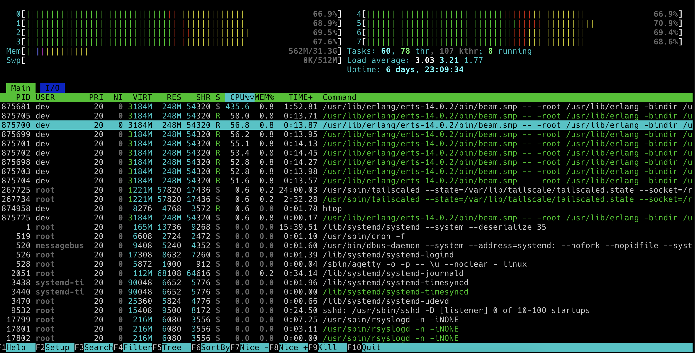
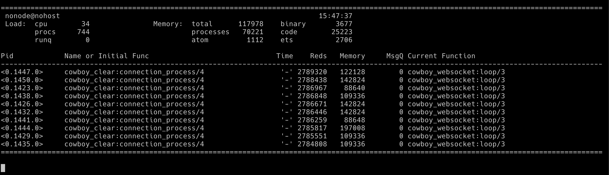
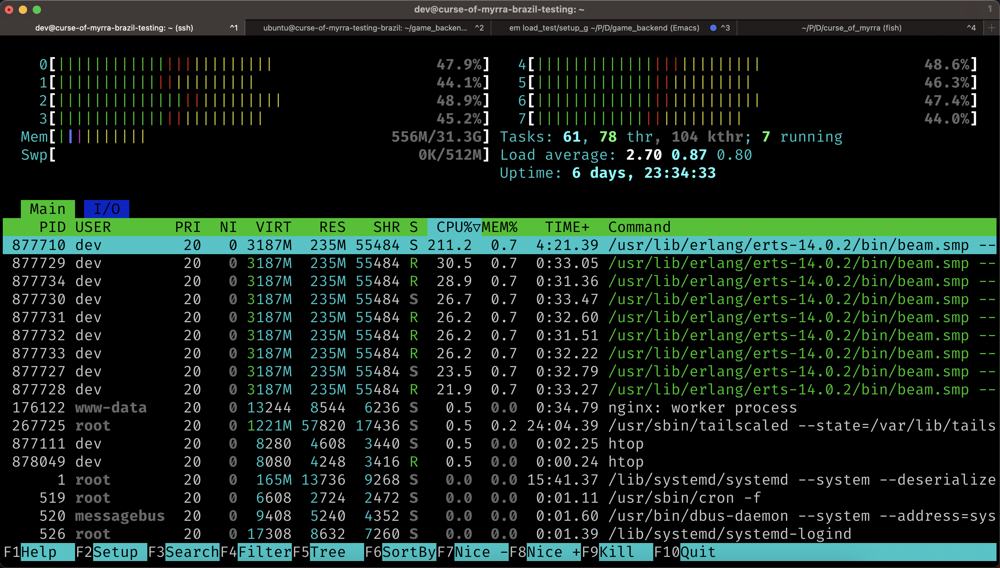
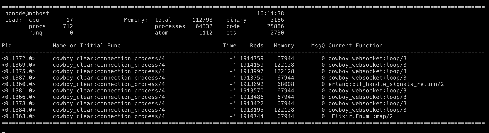

## Specs:
### Game Server:
- OS: Debian 6.1
- CPU: AMD EPYC 7443P (virtualized, 8 cores).
- Hyper-thread _disabled_.
- 32GB RAM.
- 512MB Swap.
- location: Brazil
- Erlang version: OTP26.0.2
- Elixir version: 1.15.4 (compiled with Erlang/OTP 26)

### Load Testing Client:
- OS: -
- CPU: Intel(R) Xeon(R) Platinum 8259CL CPU @ 2.50GHz (virtualized, 2 cores).
- 4GB RAM.
- 0GB Swap.
- location: Brazil
- Erlang version OTP26.0.2
- Elixir version 1.15.4 (compiled with Erlang/OTP 26)

### Purpose of the load test:

- [ ] Regular
- [X] Feature (commit: `ba29053`, branch `separate-movement-from-tick`)
    - The change consist of 2 things:
        - sending direction updates instead of movement updates. This
        enables us to send inputs less frequently and thus for the
        load test we'll compare what happens between `main` (one input update every 30ms) vs `separate-movement-from-tick` 120ms
        
### Any relevant changes to consider

- Currently we only have muflus so the game has no projectiles

## Tests

- How many games are you running?: 20 games of 10 players each.
- How many updates are the clients sending: one update every 30ms when ran on `main` branch and one update every 120ms when ran on `separate-movement-from-tick`

### Test Methodology

We'll be running tests while we also try to play with the app to see if there
is a noticeable downgrade on the UX. We'll run using
`LoadTest.PlayerSupervisor.spawn_players(NUMBER_OF_USERS, PLAY_TIME)` where
PLAY_TIME is the amount in seconds the players play before closing the
connection in seconds.

- 20 games of 10 players each (NUMBER_OF_USERS = 200), PLAY_TIME = 5min, updates every 30ms on `main` branch
- 20 games of 10 players each (NUMBER_OF_USERS = 200), PLAY_TIME = 5min, updates every 120ms on `separate-movement-from-tick` branch

## Test Results

### 20 games of 10 players each, PLAY_TIME = 5min, updates every 30ms on `main` branch 

#### Briefly describe the UX exprerience:
Tested without any noticeable issues. It was a good exprerience overall.

#### Screenshots of htop, newrelic and other extra tools if used

### 20 games of 10 players each, PLAY_TIME = 5min, updates every 120ms on `separate-movement-from-tick` branch 
#### Briefly describe the UX exprerience:
Tested without any noticeable issues. It was a good exprerience overall.

#### Screenshots of htop, newrelic and other extra tools if used

## Measures taken

- We can see there's about 20% reduction of CPU usage.
- We'll run the same test but with games of 20 players each.

