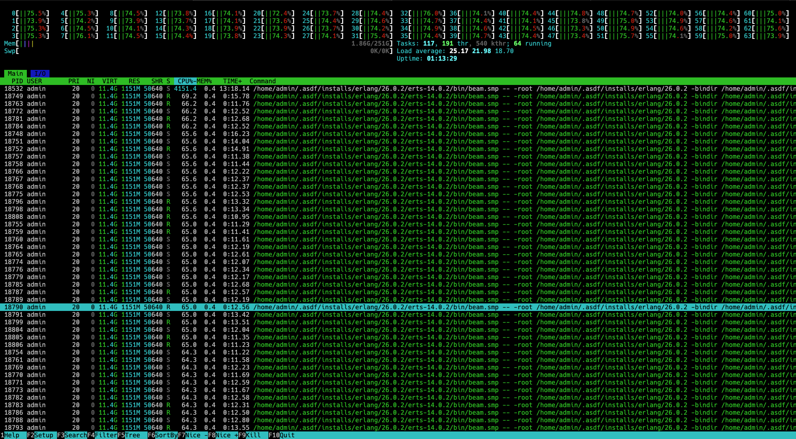
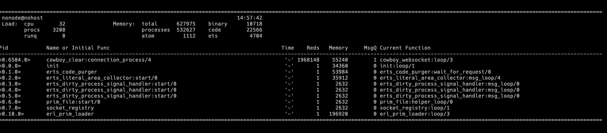
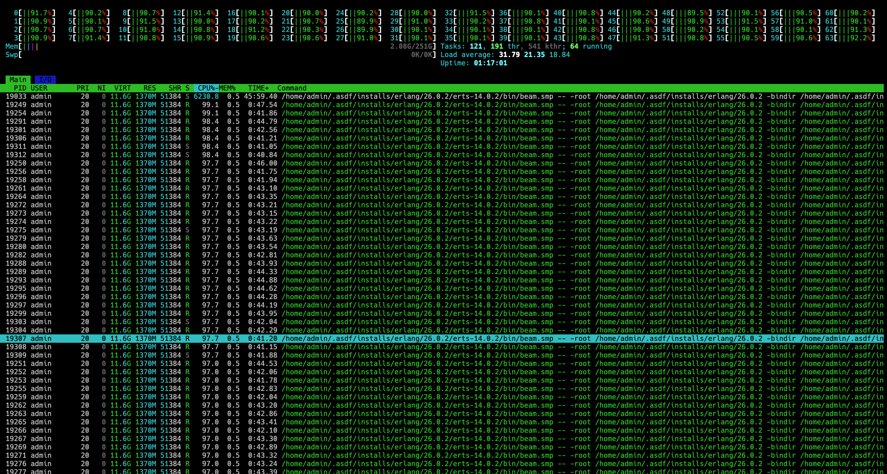
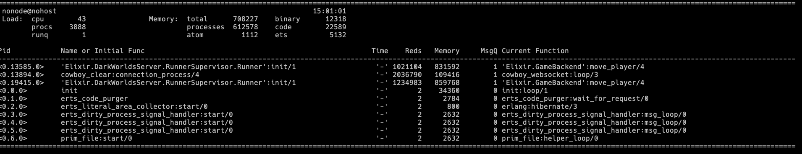
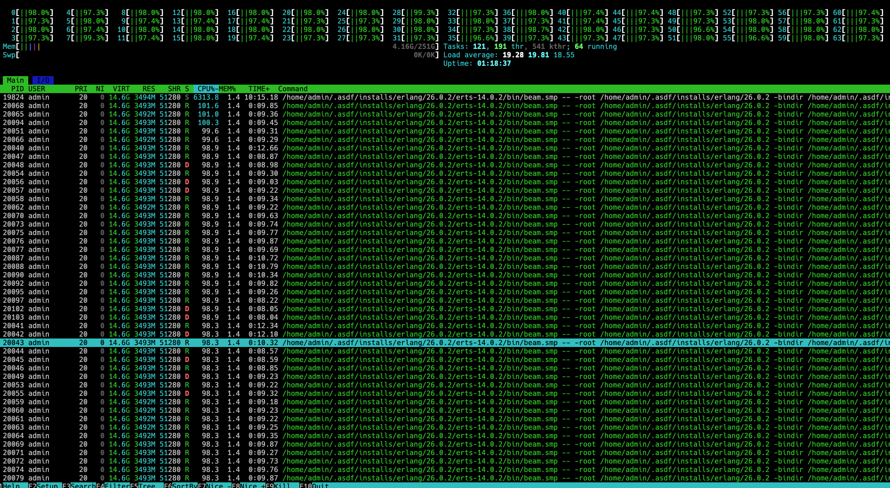

## Specs:
### Game Server:
- OS: Debian 12
- CPU: ARM Neoverse-V1 64 Cores.
- Hyper-thread `disabled`.
- 256GB RAM.
- no swap.
- location: Oregon, USA (West Coast)
- Erlang version: OTP26.0.2
- Elixir version: 1.15.4 (compiled with Erlang/OTP 26)

### Load Testing Client:
- OS: Debian 12
- CPU: ARM Neoverse-V1 8 Cores.
- 32GB RAM.
- no swap.
- location: Oregon, USA (West Coast)
- Erlang version: OTP26.0.2
- Elixir version: 1.15.4 (compiled with Erlang/OTP 26)

### Purpose of the load test:

- [ ] Regular
- [X] Feature(commit: `ba29053`, branch `separate-movement-from-tick`) 
    - The change consist of 2 things:
        - sending direction updates instead of movement updates. This
        enables us to send inputs less frequently and thus for this
        load test we want to see when do we hit 80% CPU usage and 100% CPU usage on `separate-movement-from-tick` sending updates every 120ms 

### Any relevant changes to consider

- H4ck is still disabled so we don't have projectiles yet

## Tests

- How many games are you running?: 
    - 240 games of 10 players each.
    - 300 games of 10 players each.
    - 320 games of 10 players each.
- How many updates are the clients sending: one update every 120 milliseconds

### Test Methodology

We'll be running tests while we also try to play with the app to see if there
is a noticeable downgrade on the UX. We'll run using
`LoadTest.PlayerSupervisor.spawn_players(NUMBER_OF_USERS, PLAY_TIME)` where
PLAY_TIME is the amount in seconds the players play before closing the
connection in seconds.

- 240 games of 10 players each (NUMBER_OF_USERS = 2400), PLAY_TIME = 10min
- 300 games of 10 players each (NUMBER_OF_USERS = 3000), PLAY_TIME = 10min
- 320 games of 10 players each (NUMBER_OF_USERS = 3200), PLAY_TIME = 10min

## Test Results

### 240 games of 10 players each, 10 minutes

With 240 games **we reached the 80% CPU usage** mark.

#### Briefly describe the UX exprerience:
Regarding UX ...

#### Screenshots of htop, newrelic and other extra tools if used

### 300 games of 10 players each, 10 minutes

With 300 games we reached the 90% CPU usage mark.

#### Briefly describe the UX exprerience:
Regarding UX ...

#### Screenshots of htop, newrelic and other extra tools if used

### 320 games of 10 players each, 10 minutes
With 320 games we quickly reached the 100% CPU usage mark. Etop crashed because it took too much time to generate a result.

#### Briefly describe the UX exprerience:
Regarding UX ...

#### Screenshots of htop, newrelic and other extra tools if used

## Measures taken

This could be a mix of a conclusion and actions taken from it or other new
measurements gathered.
