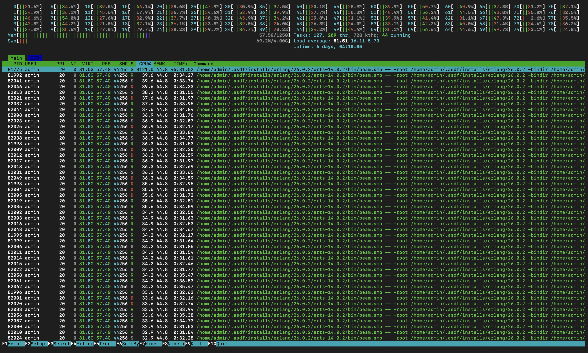
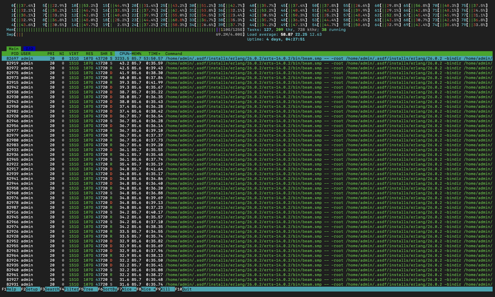

## Specs:
### Game Server:
- OS: Debian GNU/Linux 12 (bookworm)
- CPU: ARM Neoverse-N1
- Hyper-thread `disabled`.
- 125GB RAM.
- 4GB Swap.
- location: Europe
- Erlang version: 26.0.2
- Elixir version: 1.15.4

### Load Testing Client:
- OS: Debian GNU/Linux 12 (bookworm)
- CPU: Intel(R) Xeon(R) Gold 5412U
- Hyper-thread `disabled`.
- 251GB RAM.
- 4GB Swap.
- location: Europe
- Erlang version: 26.0.2
- Elixir version: 1.15.4

### Purpose of the load test:

- [ ] Regular
- [X] Feature (commit: `ba2905393ca2e7396dd939579ce29cfb9d7427dc`)
    - Send ticks every 120ms instead of 30ms. Fix client prediction for this purpose.

### Any relevant changes to consider

Tickrate was changed from 30ms to 120ms. This means that the server will send less updates to the clients, resulting in less data to be sent and less processing on the client side.

## Tests

- How many games are you running?: 350 games of 10 players each and 400 games of 10 players each.
- How many updates are the clients sending: one update every 120 milliseconds

### Test Methodology

We'll be running tests while we also try to play with the app to see if there
is a noticeable downgrade on the UX. We'll run using
`LoadTest.PlayerSupervisor.spawn_players(NUMBER_OF_USERS, PLAY_TIME)` where
PLAY_TIME is the amount in seconds the players play before closing the
connection in seconds.

- 350 games of 10 players each (NUMBER_OF_USERS = 3500), PLAY_TIME = 5min
- 400 games of 10 players each (NUMBER_OF_USERS = 4000), PLAY_TIME = 5min

## Test Results

### 350 games of 10 players each, 5 minutes

#### Briefly describe the UX exprerience:
The game was playable, but there was a noticeable delay between the player's input and the server's response. Also, there was a drift when the player turned

#### Screenshots of htop, newrelic and other extra tools if used

### 400 games of 10 players each, 5 minutes
#### Briefly describe the UX exprerience:
I didn't get to test the UI as there was a peak of use of the processors (around 90% each) and the use of RAM increased very rapidly. 

#### Screenshots of htop, newrelic and other extra tools if used

## Conclusion

We could say that the game is playable with 3500 players, but with some issues in the UI such as the drift in the character's movement and the delay between the backend and the client. The game is not playable with 4000 players, as the server's CPU usage is too high and the RAM usage increases very rapidly.
